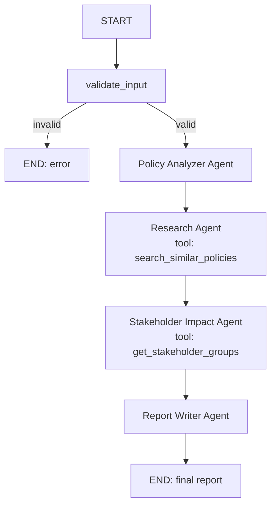

# Policy Impact Analysis System

**Domain:** Legal, Governance & Public Policy
**Problem statement:** Agents analyze a proposed policy, research similar
policies, assess stakeholder impacts, and generate a balanced impact
report.

A multi-agent system built with **LangGraph** for orchestration and the
**OpenAI API** (function/tool calling) for each agent's reasoning.

---

## 1. Architecture

Four agents run in a fixed pipeline, coordinated by a LangGraph
`StateGraph` that passes a shared `PipelineState` dict between them. One
conditional edge gives basic orchestration logic beyond a straight line
(an empty/too-short policy input short-circuits straight to `END`).



| # | Agent | File | Tool(s) used | Role |
|---|---|---|---|---|
| 1 | Policy Analyzer | `agents/policy_analyzer_agent.py` | none | Parses raw policy text into a structured brief (title, domain, objectives, provisions, target population) |
| 2 | Research Agent | `agents/research_agent.py` | `search_similar_policies` (live web search) | Finds real-world precedent policies and summarizes outcomes |
| 3 | Stakeholder Impact Agent | `agents/stakeholder_agent.py` | `get_stakeholder_groups` (lookup) | Assesses impact per stakeholder group |
| 4 | Report Writer | `agents/report_writer_agent.py` | none | Synthesizes 1-3 into one balanced markdown report |

**Tool calling** is implemented with the OpenAI `tools` API. Agents 2 and 3
are given a tool schema and decide for themselves, at runtime, whether and
how to call it; `llm_utils.run_agent_with_tools` implements the generic
"call model -> execute any requested tool -> feed result back -> repeat"
loop shared by both agents.

**Orchestration** is handled by `graph.py`, which wires the four agent
functions into LangGraph nodes with a shared `PipelineState`
(`TypedDict`), plus the input-validation conditional branch described
above.

---

## 2. Project structure

```
policy-impact-multiagent/
├── agents/
│   ├── policy_analyzer_agent.py
│   ├── research_agent.py
│   ├── stakeholder_agent.py
│   └── report_writer_agent.py
├── tools/
│   ├── search_tool.py        # search_similar_policies (DuckDuckGo)
│   └── stakeholder_tool.py   # get_stakeholder_groups (lookup table)
├── sample_run/
│   ├── sample_policy.txt     # example input
│   └── sample_output.md      # illustrative example output
├── config.py                 # env vars, shared OpenAI client
├── llm_utils.py              # call_llm() + run_agent_with_tools() loop
├── graph.py                  # LangGraph StateGraph orchestration
├── main.py                   # CLI entry point
├── requirements.txt
└── .env.example
```

---

## 3. Setup

```bash
git clone <your-repo-url>
cd policy-impact-multiagent
python -m venv venv
source venv/bin/activate        # Windows: venv\Scripts\activate
pip install -r requirements.txt

cp .env.example .env
# edit .env and set OPENAI_API_KEY=sk-...
```

## 4. Running it

```bash
# Run on the built-in sample policy (congestion pricing example)
python main.py

# Run on your own policy proposal
python main.py --file path/to/policy.txt
python main.py --text "Proposed policy: ..."

# Choose where the report is saved (default: output_report.md)
python main.py --out my_report.md
```

Each agent prints a one-line progress log (`[AgentName] ...`) as it runs,
including every tool call it makes, so you can see the orchestration
happening step by step. The final report is printed to the console and
saved to the output file.

`sample_run/sample_output.md` shows the expected shape of the final report
for the bundled sample policy, for reference without needing an API key.

## 5. Configuration

All settings live in `.env` (see `.env.example`):

| Variable | Default | Purpose |
|---|---|---|
| `OPENAI_API_KEY` | *(required)* | Your OpenAI API key |
| `MODEL_NAME` | `gpt-4o-mini` | Chat model used by every agent |
| `OPENAI_BASE_URL` | *(unset)* | Point at an OpenAI-compatible endpoint instead |
| `MAX_TOOL_ITERATIONS` | `4` | Safety cap on the tool-calling loop per agent |
| `VERBOSE` | `true` | Print per-agent progress logs |

## 6. Notes on design choices

- **Why LangGraph?** It makes the pipeline's state and control flow
  explicit (a `StateGraph` with typed state) rather than a chain of manual
  function calls, and makes adding branching logic (like the input
  validation step) straightforward.
- **Why real tool calling instead of just calling Python functions
  directly?** The assignment requires demonstrating tool calling as an
  agentic pattern - the LLM itself decides *whether* and *what* to search
  for / look up, rather than the orchestration code always calling the
  function unconditionally.
- **Graceful degradation:** `search_similar_policies` falls back to a
  placeholder result if the web search backend is unreachable, so the
  pipeline still completes end-to-end for a demo in an offline/restricted
  environment.

## 7. Author

Student submission for CE509 Agentic AI - Computer DLOC Lab I.
